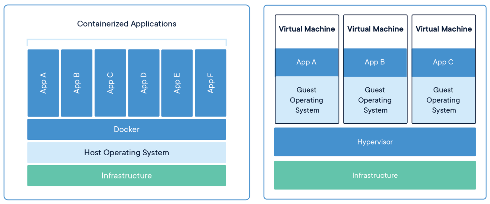
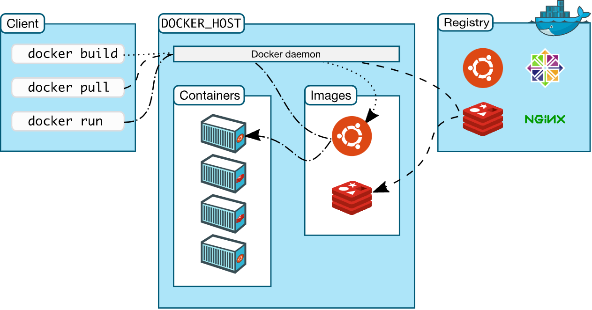

# Docker Interview Questions

> *Click  if you like the project. Your contributions are heartily ♡ welcome.*

## Table of Contents

* *[Docker Workshop](docker-practice.md)*
* *[Jenkins Interview Questions](jenkins.md)*
* *[Docker Interview Questions](docker.md)*
* *[Kubernetes Interview Questions](kubernetes.md)*
* *[Cloud Computing Interview Questions](cloud.md)*

## Q. ***What is the Difference Between Containers and Virtual Machines?***

  

**Virtual Machines:**

A virtual machine (VM) is best described as a software program that emulates the functionality of a physical hardware or computing system. It runs on top of an emulating software, called the hypervisor, which replicates the functionality of the underlying physical hardware resources with a software environment. These resources may be referred to as the host machine, while the VM that runs on the hypervisor is often called a guest machine.

The virtual machine contains all necessary elements to run the apps, including:

* Computing
* Storage
* Memory
* Networking
* Hardware functionality available as a virtualized system

The VM may also contain the necessary system binaries and libraries to run the apps. The actual operating system (OS), however, is managed and executed using the hypervisor.

**Containers:**

Containerization creates abstraction at an OS level that allows individual, modular, and distinct functionality of the app to run independently. As a result, several isolated workloads—the containers—can dynamically operate using the same physical resources.

A less technical definition of containers might be: a unit of software that is lightweight but still bundles the code, its dependencies, and the configuration altogether into a single image. Containers can run:

* On top bare metal servers
* On top hypervisors
* In cloud infrastructure

Containers share all necessary capabilities with the VM to operate as an isolated OS environment for a modular app functionality with one key difference. Using a containerization engine, such as the Docker Engine, containers create several isolated OS environments within the same host system kernel, which can be shared with other containers dedicated to run different functions of the app. Only bins, libraries, and other runtime components are developed or executed separately for each container, which makes them more resource efficient as compared to VMs.

    <b><a href="#">↥ back to top</a></b>

## Q. ***What is Hypervisor?***

A hypervisor is a software that makes virtualization possible. It is also called Virtual Machine Monitor. It divides the host system and allocates the resources to each divided virtual environment. You can basically have multiple OS on a single host system. There are two types of Hypervisors:

* **Type 1:** It\'s also called Native Hypervisor or Bare metal Hypervisor. It runs directly on the underlying host system. It has direct access to your host\'s system hardware and hence does not require a base server operating system.
* **Type 2:** This kind of hypervisor makes use of the underlying host operating system. It\'s also called Hosted Hypervisor.

    <b><a href="#">↥ back to top</a></b>

## Q. ***What is virtualization?***

Virtualization is the process of creating a software-based, virtual version of something(compute storage, servers, application, etc.). These virtual versions or environments are created from a single physical hardware system. Virtualization lets you split one system into many different sections which act like separate, distinct individual systems. A software called Hypervisor makes this kind of splitting possible. The virtual environment created by the hypervisor is called Virtual Machine.

    <b><a href="#">↥ back to top</a></b>

## Q. ***What is containerization?***

Usually, in the software development process, code developed on one machine might not work perfectly fine on any other machine because of the dependencies. This problem was solved by the containerization concept. So basically, an application that is being developed and deployed is bundled and wrapped together with all its configuration files and dependencies. This bundle is called a container. Now when you wish to run the application on another system, the container is deployed which will give a bug-free environment as all the dependencies and libraries are wrapped together. Most famous containerization environments are Docker and Kubernetes.

    <b><a href="#">↥ back to top</a></b>

## Q. ***Difference between virtualization and containerization***

Containers provide an isolated environment for running the application. The entire user space is explicitly dedicated to the application. Any changes made inside the container is never reflected on the host or even other containers running on the same host. Containers are an abstraction of the application layer. Each container is a different application.

Whereas in Virtualization, hypervisors provide an entire virtual machine to the guest(including Kernal). Virtual machines are an abstraction of the hardware layer. Each VM is a physical machine. VM is more isolated and heavy and takes a lot time to start.

    <b><a href="#">↥ back to top</a></b>

## Q. ***What is Docker?***

Docker is a containerization platform which packages your application and all its dependencies together in the form of containers so as to ensure that your application works seamlessly in any environment, be it development, test or production.
Docker containers, wrap a piece of software in a complete filesystem that contains everything needed to run: code, runtime, system tools, system libraries, etc.
It wraps basically anything that can be installed on a server. This guarantees that the software will always run the same, regardless of its environment.

  

    <b><a href="#">↥ back to top</a></b>

## Q. ***What is a Docker Container?***

Docker containers include the application and all of its dependencies. It shares the kernel with other containers, running as isolated processes in user space on the host operating system. Docker containers are not tied to any specific infrastructure: they run on any computer, on any infrastructure, and in any cloud. Docker containers are basically runtime instances of Docker images.

    <b><a href="#">↥ back to top</a></b>

## Q. ***What are Docker Images?***

Docker image is the source of Docker container. In other words, Docker images are used to create containers. When a user runs a Docker image, an instance of a container is created. These docker images can be deployed to any Docker environment.

    <b><a href="#">↥ back to top</a></b>

## Q. ***What is Docker Hub?***

Docker images create docker containers. There has to be a registry where these docker images live. This registry is Docker Hub. Users can pick up images from Docker Hub and use them to create customized images and containers. Currently, the Docker Hub is the world\'s largest public repository of image containers.

**Reference:**

* **[https://docs.docker.com/get-started/](https://docs.docker.com/get-started/)**

    <b><a href="#">↥ back to top</a></b>

## Q. ***Explain Docker Architecture?***

The Docker works on client-server architecture. The Docker client establishes communication with the Docker Daemon. The Docker client and Daemon can run on the same system. A Docket client can also be connected to a remote Docker Daemon. The different types of Docker components in a Docker architecture are–

* **Docker Client**: This performs Docker build pull and run operations to establish communication with the Docker Host. The Docker command uses Docker API to call the queries to be run.
* **Docker Host**: This component contains Docker Daemon, Containers and its images. The images will be the kind of metadata for the applications which are containerized in the containers. The Docker Daemon establishes a connection with Registry.
* **Registry**: This component will be storing the Docker images. The public registries are Docker Hub and Docker Cloud which can be s used by anyone.

    <b><a href="#">↥ back to top</a></b>

